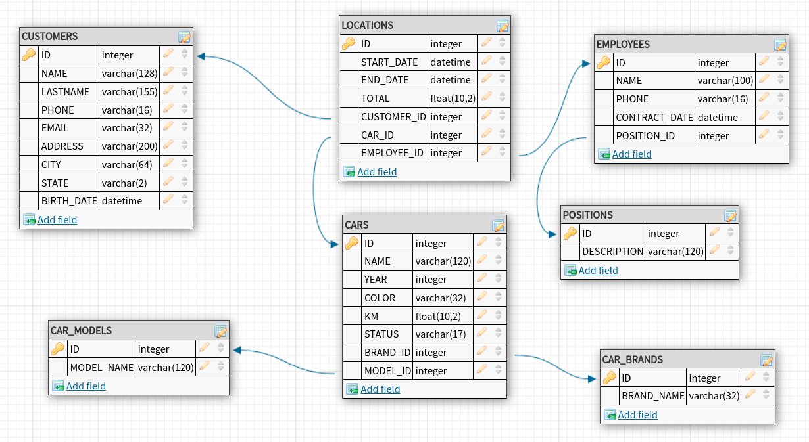

#  مشروع dbRentalcar - إدارة تأجير السيارات 

  <summary><h2>🌐 اللغات المتاحة</h2></summary>

  [](https://github.com/SamuelRocha91/dbRentalCar/blob/main/README.md) 
  [](https://github.com/SamuelRocha91/dbRentalCar/blob/main/README_es.md) 
  [](https://github.com/SamuelRocha91/dbRentalCar/blob/main/README_en.md) 
  [](https://github.com/SamuelRocha91/dbRentalCar/blob/main/README_ru.md) 
  [](https://github.com/SamuelRocha91/dbRentalCar/blob/main/README_ch.md) 
  [](https://github.com/SamuelRocha91/dbRentalCar/blob/main/README_ar.md)

<details>
  <summary><h2>📖 حول المشروع</h2></summary>

  تم تطوير هذا المشروع لإدارة عمليات تأجير السيارات. يستخدم قاعدة بيانات SQLite تُسمى `dbRentalcar.db`، موجودة في مجلد `database`، وتخزن معلومات حول العملاء، السيارات، الموظفين، والإيجارات. بالإضافة إلى ذلك، تم إنشاء هجرات، بذور واستعلامات مخصصة لإدارة واستعلام البيانات بكفاءة.

  
</details>

<details>
  <summary><h2>📁 هيكل المشروع</h2></summary>

  - **database/dbRentalcar.db**: الملف الرئيسي لقاعدة بيانات SQLite.
  - **database/migrations/**: نصوص SQL المسؤولة عن إنشاء الجداول والعلاقات بينها.
  - **database/seeds/**: نصوص لملء قاعدة البيانات بالبيانات الأولية (العملاء، السيارات، الموظفين، إلخ).
  - **query/**: يحتوي على استعلامات SQL المخصصة للتفاعل مع قاعدة البيانات.
</details>

<details>
  <summary><h2>📊 الجداول الرئيسية</h2></summary>

  الجداول التي تم إنشاؤها في قاعدة البيانات هذه تشمل:

  - **CUSTOMERS**: تخزن معلومات العملاء.
  - **CARS**: تخزن تفاصيل السيارات المتاحة للإيجار.
  - **EMPLOYEES**: تحتوي على معلومات الموظفين.
  - **LOCATIONS**: تسجل عمليات الإيجار التي تربط بين العملاء، السيارات، والموظفين.
</details>

<details>
  <summary><h2>🛠️ كيفية استخدام المشروع</h2></summary>

  1. استنساخ هذا المستودع:
     ```bash
     git clone https://github.com/SamuelRocha91/dbRentalCar
     ```

  2. تثبيت SQLite إذا لم يكن مثبتًا بالفعل:
     - على Ubuntu:
       ```bash
       sudo apt-get install sqlite3
       ```

  3. الوصول إلى قاعدة البيانات:
     ```bash
     sqlite3 database/dbRentalcar.db
     ```

  4. تنفيذ الهجرات لإنشاء الجداول:
     - انتقل إلى مجلد `database/migrations` وقم بتنفيذ ملفات SQL.

  5. ملء قاعدة البيانات باستخدام البذور:
     - انتقل إلى مجلد `database/seeds` وقم بتنفيذ ملفات SQL لإدخال البيانات الأولية.

  6. استخدم الاستعلامات المخصصة في مجلد `query` للتفاعل مع قاعدة البيانات.
</details>

<details>
  <summary><h2>🔧 الأدوات المستخدمة</h2></summary>

  - **SQLite**: نظام إدارة قواعد بيانات علائقية.
  - **SQL**: لغة الاستعلامات للتفاعل مع قاعدة البيانات.
  - **الهجرات/البذور**: نصوص لإنشاء وملء جداول قاعدة البيانات.
</details>